# Game CRUD REST API

Spring Boot를 이용해서 게임 정보를 관리하는 REST API를 구현했다.

## 1. 프로젝트 기능

게임 등록
전체 조회
ID 조회
수정
삭제
잘못된 가격 입력 시 400 응답
장르별 게임 조회

## 2. 프로젝트 구조

- controller
GameController

- service
GameService

- repository
GameRepository
MemoryGameRepository

- domain
Game

- dto
GameRequest
GameResponse

Week05Javacrud1Application

## 3. 개발 환경

IntelliJ IDEA
Java 24
Spring Boot 4.1.1
Gradle 9.7.1
Spring Web
Postman
Docker
Render

## 4. 사용한 Dependency

Spring Web

REST API를 만들고 HTTP 요청과 응답을 처리하기 위해 사용했다.

Spring Boot DevTools

코드를 수정하면서 실행 결과를 확인하기 위해 사용했다.

Spring Boot Test

Spring Boot 테스트를 위해 사용했다.

## 5. Game 데이터

id
title
genre
developer
price
rating

id는 사용자가 입력하지 않고 서버에서 자동으로 생성한다.

## 6. API

POST /api/games
게임 등록

GET /api/games
전체 게임 조회

GET /api/games/{id}
ID로 게임 조회

PUT /api/games/{id}
게임 수정

DELETE /api/games/{id}
게임 삭제

GET /api/games/genre/{genre}
장르별 게임 조회

## 7. JSON 예시

게임 등록할 때 사용한 데이터

{
"title": "Minecraft",
"genre": "Sandbox",
"developer": "Mojang",
"price": 30000,
"rating": 9.0
}

등록 후 받은 데이터

{
"id": 1,
"title": "Minecraft",
"genre": "Sandbox",
"developer": "Mojang",
"price": 30000,
"rating": 9.0
}

## 8. 실행 방법

프로젝트를 실행하고 아래 주소를 사용했다.

http://localhost:8080

## 9. Solution 분석 Q&A

Q1. Controller는 무슨 역할을 하는가?

HTTP 요청을 받고 service에 전달하는 역할을 한다.

Q2. service는 무슨 역할을 하는가?

CRUD 기능을 처리하고 Repository를 사용하는 역할을 한다.

Q3. Repository Interface는 왜 사용하는가?

Service가 저장하는 방식에 바로 연결되지 않게 하기 위해 사용한다.

Q4. ID는 어디서 생성되는가?

MemoryGameRepository의 save에서 sequence 값을 만든다.

Q5. 없는 ID를 조회하면 어떻게 되는가?

GameService의 findGame에서 404 Not Found 가 나옴.

Q6. GameRequest와 GameResponse의 차이는 무엇인가?

GameRequest에는 id가 없고 GameResponse에는 id가 있다.

## 10. 개발 과정

먼저 Game 클래스를 만들었다.

Request와 Response를 만들었다.

Repository Interface와 Memory Repository를 만들었다.

Service에서 CRUD 기능을 만들었다.

Controller에서 API 주소와 연결했다.

그 다음 가격 오류 처리, 장르 조회 기능을 추가했다.

마지막으로 Postman에서 기능을 테스트했다.

## 11. 추가 기능 A

가격에 음수를 입력하면 400 Bad Request가 나오도록 했다.

등록과 수정에서 price가 0보다 작은지 확인하도록 했다.

## 12. 추가 기능 B

게임을 장르별로 조회할 수 있게 했다.

GET /api/games/genre/RPG

## 13. 테스트 결과
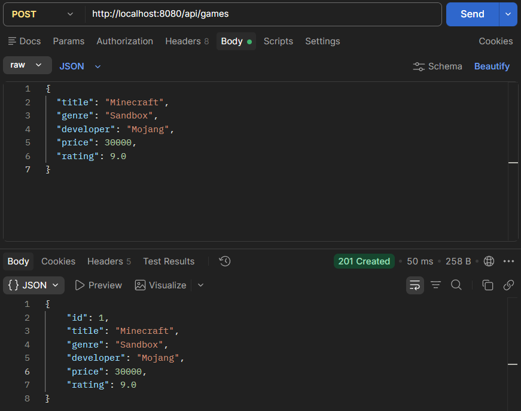
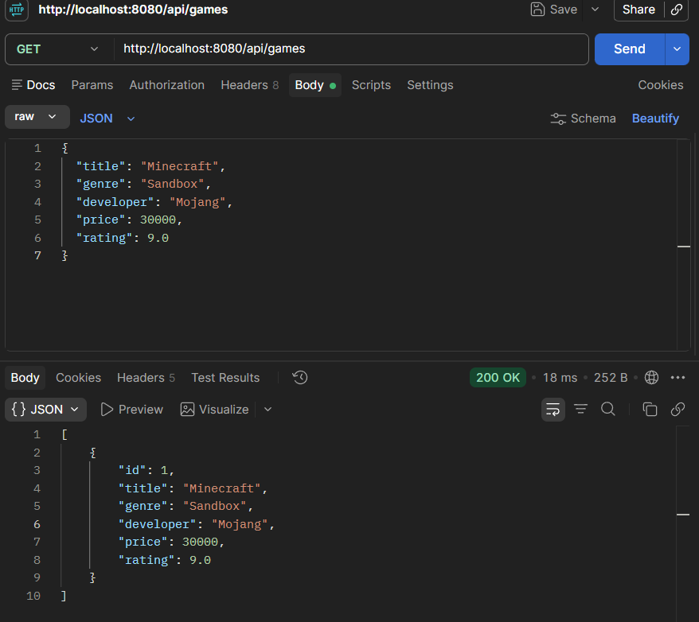
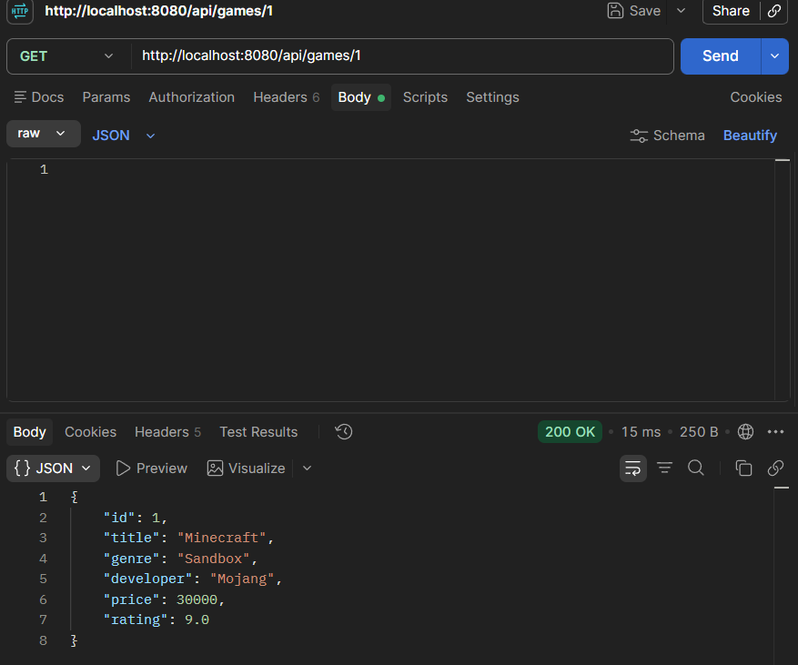
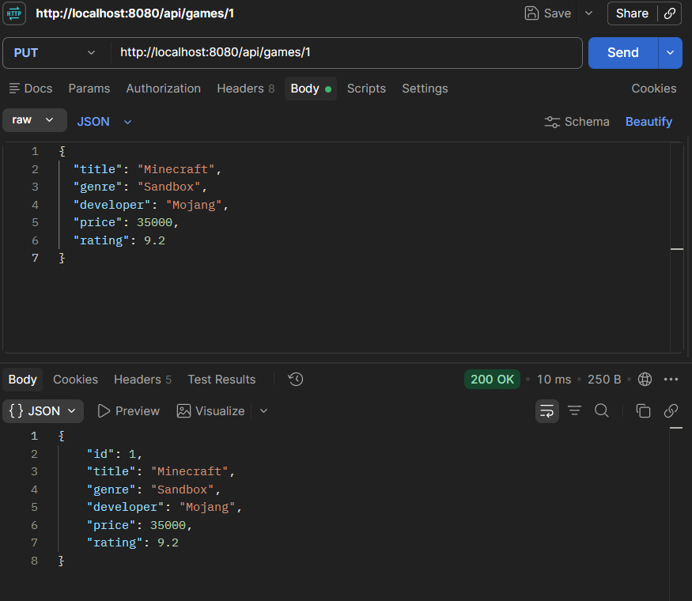
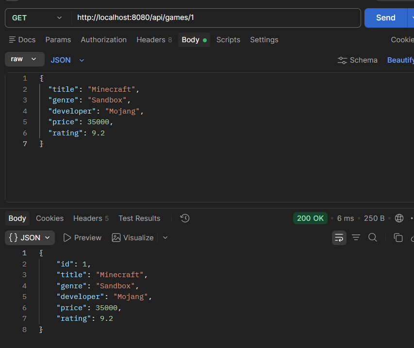
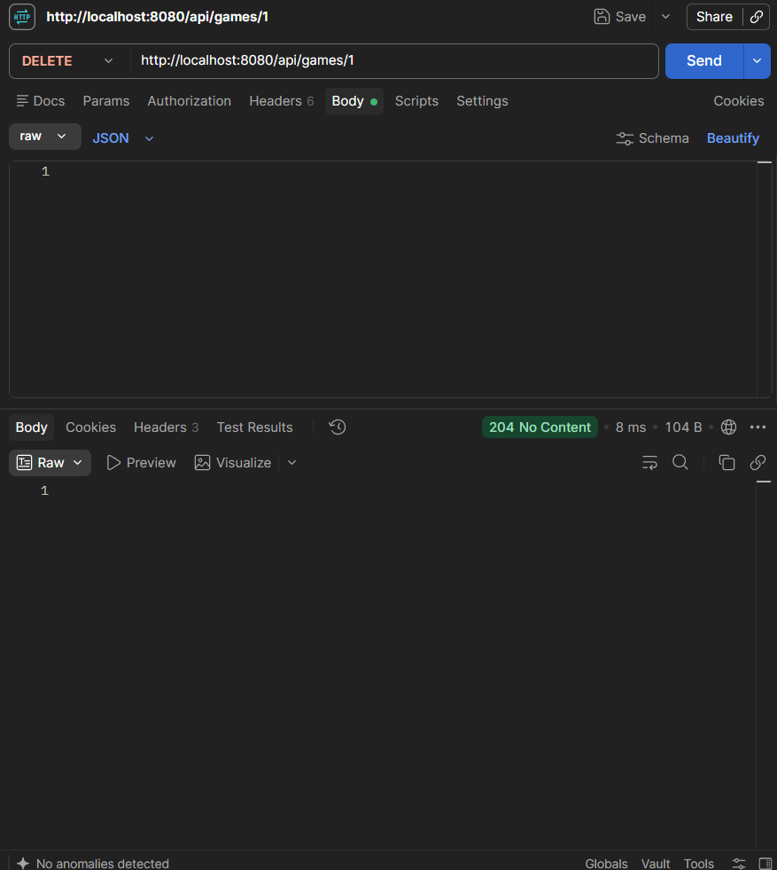
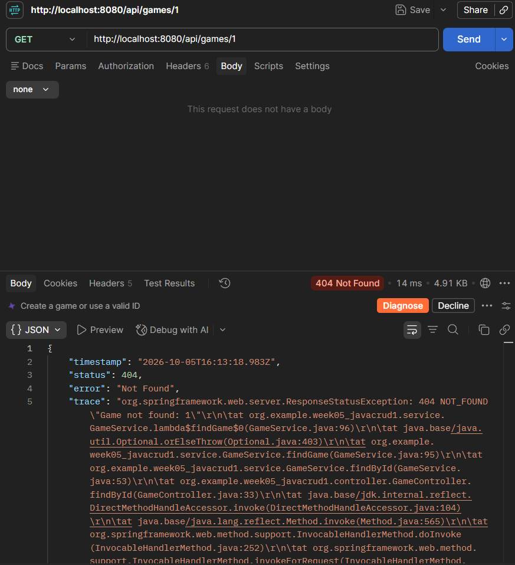
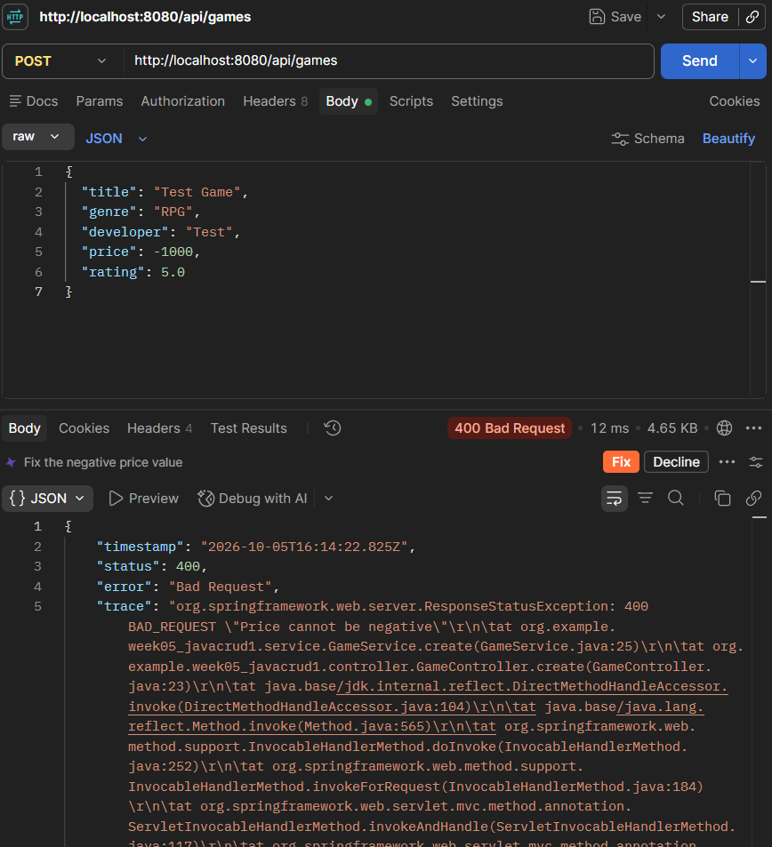
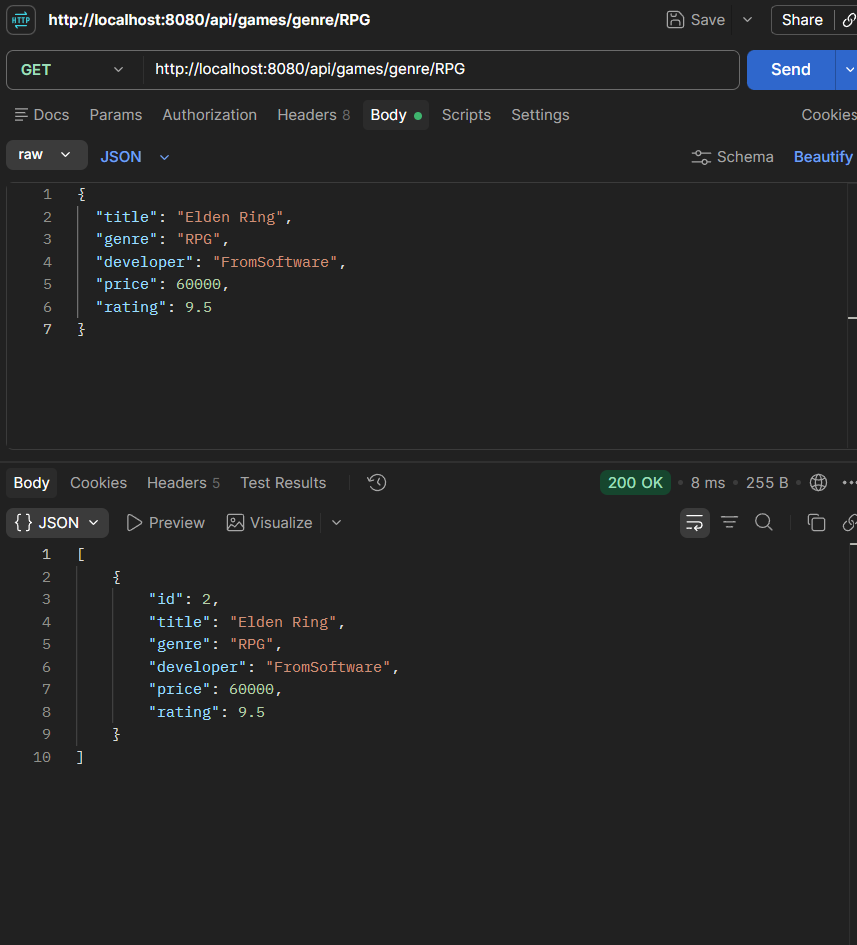
## 14. Docker

프로젝트를 배포하기 위해 Dockerfile을 추가하고
Java 환경에서 Gradle로 프로젝트를 빌드하고 실행하도록 만들었다.

## 15. 배포 과정
개인 GitHub Repository를 Render에 연결했다.

Docker 방식으로 배포했고 Dockerfile을 이용해서 실행했다.

Dockerfile가 정상적으로 배포됐다.

## 16. 배포 테스트

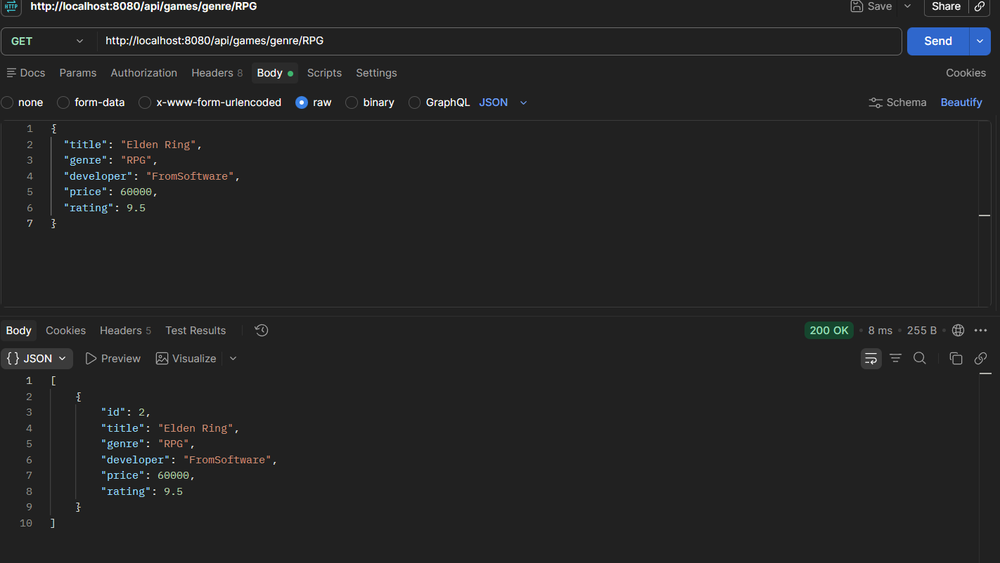
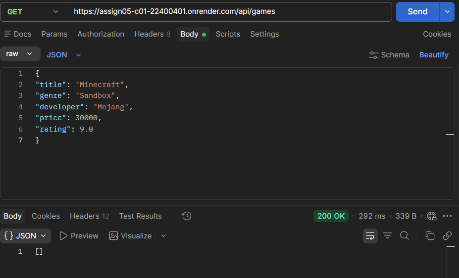
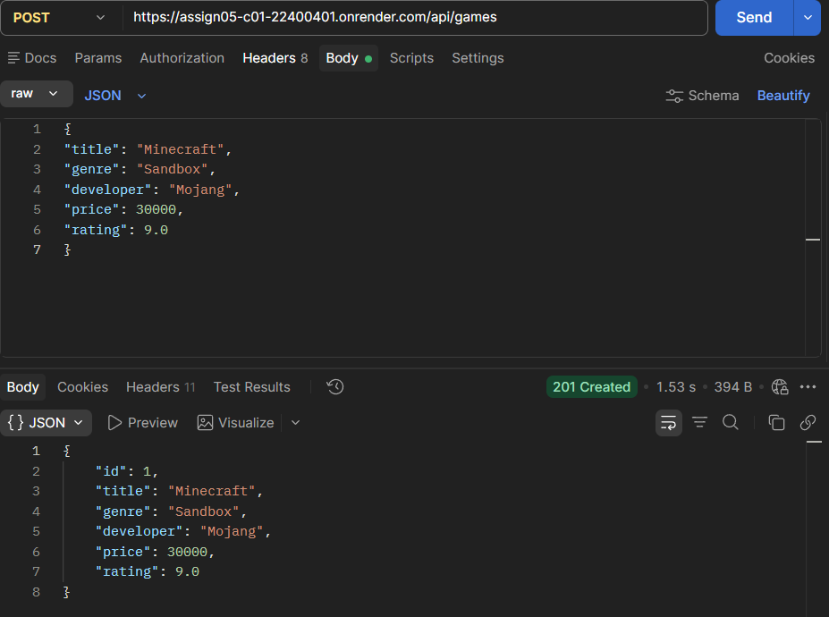
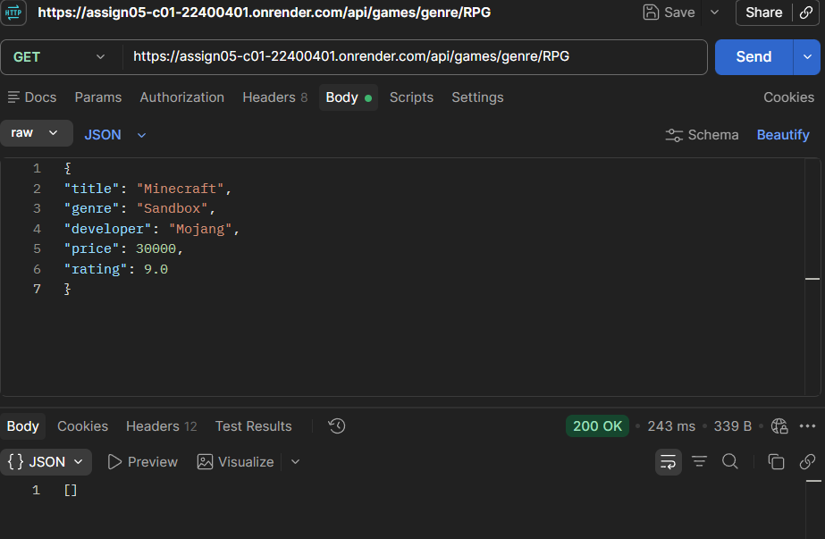
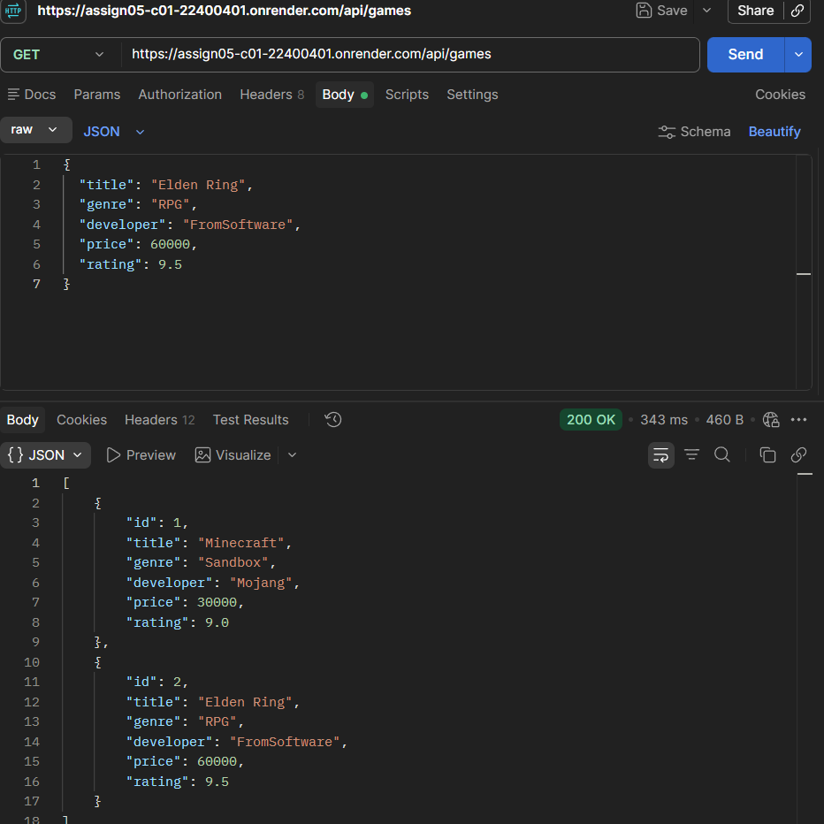
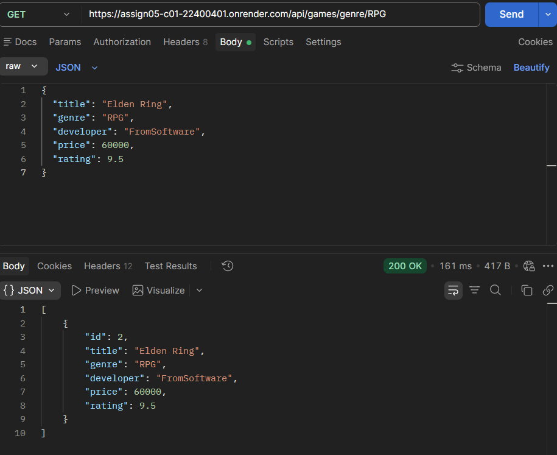

## 17. URL

Organization Repository
https://github.com/2026-2-WebService/assign05-c01-22400401

Personal Repository
https://github.com/6heang-maker/assign05-c01-22400401

배포 URL
https://assign05-c01-22400401.onrender.com

## Key Learning

Spring Boot에서 Controller Service Repository가 어떻게 연결되는지 알게 됐다.

HTTP Method에 따라 같은 주소에서도 다른 기능을 사용할 수 있다는 것을 확인했다.

Postman으로 직접 요청을 보내면서 상태 코드도 확인했다.

## Problem & Solution

처음에는 파일들이 많아서 각각 무슨 역할인지 헷갈렸다. 원래 만들었던 거에 다시 만들었다가 겹쳐서 파일 
아예 새로 처음부터 만들어서 했다.

Postman으로 게임을 등록할 때 400 오류가 났는데
확인해보니 GameRequest에 필요한 값이 Body에 전부 들어가지 않아서 생긴 문제였다.

## Code Review

만들면서 보니까 Controller는 요청을 받고 Service에서 기능을 처리하고 Repository에서 
데이터를 저장하는 식으로 나눠져 있었다.

## AI Usage

코드를 작성하면서 오류가 난 부분을 확인할 때 사용했다.

Java 버전 문제나 Postman에서 요청 보내는 방법도 확인했다.

리드미 작성에 빠진 부분이나 형식에 도움을 받았다.

## Reflection

내가 머리로 이해하고 답이 정해져 있어도 자동완성없이 오타내면서 손으로 작성하는게 도움이 되는 것 같다. 

Postman으로 등록하고 수정하고 삭제한 결과가 바로 보여서 흐름을 이해하기 쉬웠다.

